# 20260720_PLAN_CN.md

```mermaid
flowchart TD

    %% =========================
    %% 外部执行与配置层
    %% =========================
    subgraph EXEC["执行与编排层（不属于 src）"]
        SLURM["slurm/train_one.sbatch<br/>声明 GPU、CPU、内存与环境变量"]
        SMOKE["slurm/run_smoke.sh<br/>提交 LoRA / Full FT smoke jobs"]
        CLI["scripts/train.py<br/>解析参数并启动单次实验"]
        SWEEP["scripts/generate_sweep_configs.py<br/>生成实验配置"]
        CONFIG["configs/*.yaml<br/>实验声明"]
    end

    %% =========================
    %% 训练总控层
    %% =========================
    subgraph ORCH["训练总控层（src/training）"]
        EXP["training.experiment.ExperimentRunner<br/>端到端实验编排"]
        CFG["training.config<br/>配置解析、类型转换与验证"]
        SETUP["training.setup<br/>构建模型、数据与优化器"]
        ENGINE["training.engine.TrainerEngine<br/>统一训练循环"]
        CKPT["training.checkpoint<br/>保存、重载与大小统计"]
        RESULT["training.results<br/>结果数据结构与原子写入"]
        OPTIM["training.optim<br/>构建 AdamW 优化器"]
    end

    %% =========================
    %% 模型训练方法层
    %% =========================
    subgraph METHOD["训练方法层（src/methods）"]
        METHOD_FACTORY["methods.configure_training_method<br/>Full FT / LoRA 方法分派"]
        COMMON["methods.common<br/>参数统计与训练参数合同"]
        FULLFT["methods.full_ft<br/>配置 Full Fine-tuning"]
        LORA["methods.lora<br/>注入并验证 LoRA adapter"]
    end

    %% =========================
    %% 数据层
    %% =========================
    subgraph DATA["数据层（src/data，现有模块）"]
        GSM["data.gsm8k.prepare_gsm8k_datasets<br/>加载、划分与 tokenize GSM8K"]
        COLLATOR["data.gsm8k.CausalLMCollator<br/>动态 padding 与 token 统计"]
        HF_DATA["Hugging Face DatasetDict<br/>train / validation / test"]
        DATALOADER["PyTorch DataLoader<br/>训练和验证 batch"]
    end

    %% =========================
    %% 模型与依赖
    %% =========================
    subgraph MODEL["模型与第三方库"]
        TOKENIZER["Transformers AutoTokenizer<br/>加载 pinned tokenizer"]
        BASE_MODEL["Transformers AutoModelForCausalLM<br/>加载 pinned base model"]
        PEFT["PEFT<br/>LoraConfig / get_peft_model"]
        TORCH["PyTorch<br/>forward / backward / optimizer"]
    end

    %% =========================
    %% Systems 指标层
    %% =========================
    subgraph METRIC["Systems 指标层（src/metrics）"]
        MEMORY["metrics.memory.CudaMemoryTracker<br/>峰值 allocated / reserved memory"]
        THROUGHPUT["metrics.throughput.ThroughputTracker<br/>non-padding tokens/s"]
    end

    %% =========================
    %% 评测层
    %% =========================
    subgraph EVAL["评测层（src/evaluation，现有模块）"]
        EVAL_RUN["training.experiment.evaluate_model<br/>评测编排"]
        GENERATE["evaluation.generate.generate_predictions<br/>批量生成"]
        SAVE_PRED["evaluation.generate.save_predictions_jsonl<br/>保存预测"]
        EXACT["evaluation.exact_match<br/>答案提取与 exact match"]
    end

    %% =========================
    %% 运行时制品
    %% =========================
    subgraph ARTIFACT["运行时存储"]
        DATA_DIR["data/<br/>HF cache 与临时文件"]
        CHECKPOINT_DIR["checkpoints/<br/>最终 Full FT 模型或 LoRA adapter"]
        RESULT_DIR["results/<br/>配置、元数据、预测与结果"]
        LOG_DIR["logs/<br/>Slurm stdout / stderr"]
    end

    %% =========================
    %% 执行依赖
    %% =========================
    SMOKE --> SLURM
    SLURM --> CLI
    SWEEP --> CONFIG
    CONFIG --> CLI
    CLI --> CFG
    CLI --> EXP

    %% =========================
    %% 实验总控依赖
    %% =========================
    CFG --> EXP
    EXP --> SETUP
    EXP --> ENGINE
    EXP --> CKPT
    EXP --> EVAL_RUN
    EXP --> RESULT

    %% =========================
    %% Setup 依赖
    %% =========================
    SETUP --> TOKENIZER
    SETUP --> BASE_MODEL
    SETUP --> METHOD_FACTORY
    SETUP --> GSM
    SETUP --> COLLATOR
    SETUP --> OPTIM

    %% =========================
    %% 方法层依赖
    %% =========================
    METHOD_FACTORY --> FULLFT
    METHOD_FACTORY --> LORA
    METHOD_FACTORY --> COMMON
    FULLFT --> COMMON
    LORA --> COMMON
    LORA --> PEFT
    FULLFT --> BASE_MODEL
    LORA --> BASE_MODEL

    %% =========================
    %% 数据流
    %% =========================
    TOKENIZER --> GSM
    GSM --> HF_DATA
    HF_DATA --> DATALOADER
    COLLATOR --> DATALOADER
    DATALOADER --> ENGINE

    %% =========================
    %% 优化器与训练
    %% =========================
    METHOD_FACTORY --> OPTIM
    COMMON --> OPTIM
    OPTIM --> ENGINE
    BASE_MODEL --> ENGINE
    PEFT --> ENGINE
    ENGINE --> TORCH
    ENGINE --> MEMORY
    ENGINE --> THROUGHPUT

    %% =========================
    %% Checkpoint 流
    %% =========================
    ENGINE --> CKPT
    TOKENIZER --> CKPT
    CKPT --> CHECKPOINT_DIR
    CHECKPOINT_DIR --> CKPT
    CKPT --> EVAL_RUN

    %% =========================
    %% 评测流
    %% =========================
    HF_DATA --> EVAL_RUN
    TOKENIZER --> GENERATE
    CKPT --> GENERATE
    EVAL_RUN --> GENERATE
    GENERATE --> EXACT
    GENERATE --> SAVE_PRED
    EXACT --> EVAL_RUN
    SAVE_PRED --> RESULT_DIR

    %% =========================
    %% 结果与存储
    %% =========================
    MEMORY --> RESULT
    THROUGHPUT --> RESULT
    COMMON --> RESULT
    CKPT --> RESULT
    EVAL_RUN --> RESULT
    RESULT --> RESULT_DIR

    TOKENIZER -.缓存.-> DATA_DIR
    BASE_MODEL -.缓存.-> DATA_DIR
    GSM -.缓存.-> DATA_DIR

    SLURM -.标准输出与错误.-> LOG_DIR
```



## 1. 文档目的

本文档定义了 MLSys LoRA 项目中训练与评估子系统的软件工程实现计划。

该实现必须支持以下实验流水线：

```text
实验 YAML
    ↓
加载固定版本的 tokenizer 和 model
    ↓
通过现有数据模块加载并预处理 GSM8K
    ↓
配置全量微调（Full Fine-tuning）或 LoRA
    ↓
在共享实验协议下进行训练
    ↓
测量 GPU 显存、非填充 tokens/s 和训练时间
    ↓
保存并重新加载最终推理产物
    ↓
生成 GSM8K 预测结果
    ↓
计算确定性精确匹配（exact match）
    ↓
写入标准化实验产物
```

主要研究对比是在单张 A40 48 GB GPU 上，在匹配的数据、有效批次大小、精度、训练 token 预算和评估设置下，对比全量微调与 LoRA。所需的系统指标包括：峰值 GPU 显存、非填充 tokens/s、训练时间、可训练参数量、检查点大小和 GSM8K 精确匹配。

本计划有意将以下内容分离：

* 可复用的 Python 实现放在 `src/`；
* 可执行的命令行程序放在 `scripts/`；
* HPC 资源声明放在 `slurm/`；
* 实验声明放在 `configs/`；
* 运行时产物放在 `results/`、`checkpoints/`、`logs/` 和 `data/`。

任何命令行脚本、Slurm 逻辑、sweep 提交逻辑或一次性工具都不应放在 `src/` 中。

---

## 2. 权威性要求

### 2.1 共享实验控制

Full FT 和 LoRA 必须使用完全相同的：

* 模型和 tokenizer 版本；
* GSM8K 版本和数据划分；
* 提示词和 tokenization 实现；
* 在给定序列长度下保留的样本；
* 最大序列长度；
* 填充策略；
* 有效批次大小；
* 精度；
* 注意力后端；
* 训练 token 预算；
* 生成实现；
* 答案解析器和精确匹配实现。

现有数据流水线返回：

```text
input_ids
attention_mask
labels
num_non_padding_tokens
```

训练循环必须在调用模型前移除 `num_non_padding_tokens`，并将其用于吞吐量和 token 预算核算。

### 2.2 必须复用的现有组件

训练实现必须导入并复用：

```python
from data.gsm8k import (
    GSM8KDataConfig,
    CausalLMCollator,
    prepare_gsm8k_datasets,
)

from evaluation.generate import (
    generate_predictions,
    save_predictions_jsonl,
)
```

实现不得引入：

* 第二条 GSM8K 预处理路径；
* 第二个提示词模板；
* 第二个精确匹配解析器；
* 独立的 Full FT 数据集构建器；
* 独立的 LoRA 数据集构建器。

### 2.3 当前固定默认值

默认实验配置使用：

```text
模型:
Qwen/Qwen3.5-0.8B
revision 2fc06364715b967f1860aea9cf38778875588b17

回退模型:
Qwen/Qwen3-0.6B
revision c1899de289a04d12100db370d81485cdf75e47ca

数据集:
openai/gsm8k
configuration main
revision 740312add88f781978c0658806c59bc2815b9866

验证集:
500 个样本来自官方训练集
split seed 42

默认最大长度:
512

默认有效批次:
16

默认非填充训练 token 预算:
1,000,000
```

这些值已在 `configs/base.yaml` 和实验协议中声明。

---

## 3. 范围

### 3.1 包含范围

本实现包括：

1. 经验证的 YAML 配置加载；
2. 带固定版本的 tokenizer 和模型加载；
3. 全量微调配置；
4. LoRA 注入与验证；
5. 共享 GSM8K DataLoader 构建；
6. AdamW 优化器构建；
7. BF16 和 FP32 训练；
8. 梯度累积；
9. 优化器步数和 token 预算停止条件；
10. 峰值 CUDA 显存测量；
11. 非填充训练吞吐量测量；
12. CUDA OOM 分类；
13. 最终推理产物保存；
14. 最终产物重新加载验证；
15. GSM8K 生成与精确匹配评估；
16. 标准化结果和预测；
17. 单次实验的 Slurm 执行；
18. LoRA 和 Full FT 冒烟测试编排。

### 3.2 延期实现

首次实现不包括：

* 分布式数据并行；
* 多节点训练；
* DeepSpeed；
* FSDP；
* 超参数搜索框架；
* 周期性可恢复优化器检查点；
* 自动 Hugging Face 上传；
* llama.cpp 或 GGUF 转换；
* 部署服务器；
* 实验仪表板；
* 替代数据集；
* 替代评估基准。

这些只能在两个 30 步 GPU 冒烟测试通过后添加。

---

## 4. 架构原则

### 4.1 精简的可执行入口点

`scripts/train.py` 仅应：

1. 解析 CLI 参数；
2. 加载已验证的配置；
3. 调用训练库；
4. 打印最终结果；
5. 返回适当的进程退出码。

它不得包含：

* 训练循环；
* LoRA 设置；
* DataLoader 构建；
* CUDA 显存测量；
* 检查点序列化；
* 评估逻辑。

### 4.2 单一实验编排器

一个编排对象协调整个运行：

```text
ExperimentRunner
```

它可以调用底层组件，但不得重新实现它们的算法。

### 4.3 单一训练引擎

同一个 `TrainerEngine` 必须执行 Full FT 和 LoRA。

方法之间的差异必须限制在 `src/methods/` 中的模型参数化。

### 4.4 显式契约

模块边界应尽可能使用类型化的 dataclass，而非松散结构的字典。

YAML 字典仅存在于配置加载边界。验证后，其余实现必须使用类型化的配置对象。

### 4.5 无隐藏存储行为

代码不得静默地：

* 将模型复制到 `models/`；
* 物化第二个数据集；
* 保存中间检查点；
* 上传产物；
* 删除先前结果。

所有输出路径和持久化决策必须来自配置。

---

## 5. 仓库结构

```text
mlsys-lora-project/
├── src/
│   ├── data/                         # 现有
│   │   ├── __init__.py
│   │   └── gsm8k.py
│   │
│   ├── evaluation/                   # 现有
│   │   ├── __init__.py
│   │   ├── exact_match.py
│   │   └── generate.py
│   │
│   ├── analysis/                     # 现有
│   │   ├── __init__.py
│   │   ├── aggregate.py
│   │   └── plot_results.py
│   │
│   ├── methods/                      # 新增
│   │   ├── __init__.py
│   │   ├── common.py
│   │   ├── full_ft.py
│   │   └── lora.py
│   │
│   ├── metrics/                      # 新增
│   │   ├── __init__.py
│   │   ├── memory.py
│   │   └── throughput.py
│   │
│   └── training/                     # 新增
│       ├── __init__.py
│       ├── config.py
│       ├── setup.py
│       ├── optim.py
│       ├── engine.py
│       ├── checkpoint.py
│       ├── results.py
│       └── experiment.py
│
├── scripts/
│   ├── train.py                      # 新增
│   ├── smoke_data.py                 # 现有
│   ├── generate_sweep_configs.py     # 现有
│   └── submit_sweep.py               # 冒烟测试通过后延期
│
├── slurm/
│   ├── train_one.sbatch              # 新增
│   └── run_smoke.sh                  # 新增
│
├── configs/
│   ├── base.yaml
│   ├── sweeps.yaml
│   └── generated/
│
├── tests/
│   ├── unit/
│   │   ├── methods/
│   │   ├── metrics/
│   │   └── training/
│   ├── integration/
│   └── contracts/
│
├── data -> .../jhaidata/.../data
├── checkpoints -> .../jhaidata/.../checkpoints
├── logs -> .../jhaidata/.../logs
├── results/
└── reports/
```

---

## 6. 依赖方向

允许的依赖图：

```text
scripts/train.py
    ↓
training.experiment
    ├── training.config
    ├── training.setup
    │   ├── data.gsm8k
    │   └── methods
    ├── training.engine
    │   ├── training.optim
    │   └── metrics
    ├── training.checkpoint
    ├── training.results
    └── evaluation
```

以下依赖被禁止：

```text
data → training
evaluation → training
methods → scripts
metrics → scripts
src/* → slurm
src/* → scripts
training engine → argparse
training engine → YAML 解析
```

---

# 7. 模块级实现规范

## 7.1 `src/methods/common.py`

该模块定义了 Full FT、LoRA、测试和结果报告共用的模型参数工具。

### `ParameterStats`

```python
@dataclass(frozen=True)
class ParameterStats:
    total_parameters: int
    trainable_parameters: int
    frozen_parameters: int
    trainable_fraction: float
```

职责：

* 表示方法配置后的参数量；
* 为 `result.json` 提供可序列化的值；
* 避免在多个模块中重复计算。

不变量：

```text
total_parameters
= trainable_parameters + frozen_parameters
```

以及：

```text
0.0 ≤ trainable_fraction ≤ 1.0
```

### `count_parameters(model) -> ParameterStats`

职责：

* 遍历 `model.parameters()`；
* 计算所有参数元素；
* 计算 `requires_grad=True` 的参数；
* 返回 `ParameterStats`。

不得修改模型。

### `get_trainable_parameter_names(model) -> tuple[str, ...]`

职责：

* 返回所有可训练参数的名称；
* 保持模型遍历顺序；
* 支持诊断日志和 LoRA 验证。

### `assert_has_trainable_parameters(model) -> None`

职责：

* 如果没有参数需要梯度，则抛出 `ValueError`；
* 防止使用空参数列表构建优化器。

### `assert_optimizer_matches_trainable_parameters(model, optimizer) -> None`

职责：

* 收集优化器参数组中的参数标识；
* 收集 `requires_grad=True` 的参数标识；
* 如果缺少可训练参数则报错；
* 如果意外添加了冻结参数则报错。

此函数主要作为冒烟测试期间的运行时契约检查。

---

## 7.2 `src/methods/full_ft.py`

该模块仅负责配置和验证全量微调。

### `configure_full_finetuning(model) -> ParameterStats`

职责：

* 为所有模型参数设置 `requires_grad=True`；
* 返回最终参数统计；
* 不执行优化器构建；
* 不执行训练。

### `validate_full_finetuning(model) -> None`

职责：

* 断言所有预期模型参数均可训练；
* 抛出描述性错误，列出发现的冻结参数；
* 调用 `assert_has_trainable_parameters`。

该函数不得假设参数名称遵循特定架构。

---

## 7.3 `src/methods/lora.py`

该模块注入并验证 LoRA 适配器。

### `LoraMethodConfig`

规范的方法配置定义在 `training.config` 中，但此模块可导入它进行类型检查。

预期字段：

```python
rank: int
alpha: int
dropout: float
target_modules: tuple[str, ...]
bias: str
```

### `resolve_lora_target_modules(model, requested_modules) -> tuple[str, ...]`

职责：

* 验证每个配置的目标模块后缀是否存在于模型中；
* 返回已验证的目标模块元组；
* 拒绝空配置；
* 拒绝被静默忽略的目标模块；
* 在错误消息中包含可用的匹配模块名称。

模型架构不得在未记录选择的情况下在运行时猜测。

初始 YAML 应显式定义：

```yaml
method:
  target_modules:
    - q_proj
    - k_proj
    - v_proj
    - o_proj
```

额外的 MLP 目标只能作为有记录的实验变更引入。

### `configure_lora(model, config) -> tuple[object, ParameterStats]`

职责：

1. 验证 rank、alpha、dropout 和目标；
2. 创建 `peft.LoraConfig`；
3. 调用 `get_peft_model`；
4. 验证可训练性；
5. 返回包装后的模型和参数统计。

初始 LoRA 配置必须使用：

```text
task_type = CAUSAL_LM
inference_mode = false
```

### `validate_lora_trainability(model) -> None`

职责：

* 确保至少存在一个可训练参数；
* 确保可训练参数是适配器参数；
* 确保基础模型参数保持冻结；
* 抛出包含意外可训练名称的描述性错误。

此验证必须在优化器构建之前运行。

---

## 7.4 `src/methods/__init__.py`

该模块暴露方法选择 API。

### `configure_training_method(model, config) -> tuple[object, ParameterStats]`

职责：

* 根据 `config.method.name` 分发；
* 对 `full_ft` 调用 `configure_full_finetuning`；
* 对 `lora` 调用 `configure_lora`；
* 拒绝未知方法名称；
* 返回一致形状的结果。

其他模块不应手动在 Full FT 和 LoRA 设置之间分支。

---

# 8. 指标模块

## 8.1 `src/metrics/memory.py`

### `MemoryMetrics`

```python
@dataclass(frozen=True)
class MemoryMetrics:
    peak_allocated_bytes: int
    peak_reserved_bytes: int
    peak_allocated_gb: float
    peak_reserved_gb: float
```

### `CudaMemoryTracker`

#### 构造函数

```python
CudaMemoryTracker(device: torch.device)
```

职责：

* 要求 CUDA 设备；
* 存储目标设备；
* 不在构建时自动重置统计信息。

#### `reset() -> None`

职责：

* 同步 CUDA；
* 重置峰值分配和保留显存统计；
* 建立测量训练区域的起点。

不得调用 `torch.cuda.empty_cache()`，因为这会改变运行时行为且不是测量操作。

#### `snapshot() -> MemoryMetrics`

职责：

* 同步 CUDA；
* 读取最大分配显存；
* 读取最大保留显存；
* 返回字节和 GiB 值。

### `is_cuda_oom(error: BaseException) -> bool`

职责：

* 仅对已识别的 CUDA 显存不足错误返回 true；
* 避免将任意 `RuntimeError` 实例分类为 OOM；
* 支持为批次可行性 sweep 生成稳定的 OOM 结果。

---

## 8.2 `src/metrics/throughput.py`

### `ThroughputMetrics`

```python
@dataclass(frozen=True)
class ThroughputMetrics:
    measured_tokens: int
    measured_seconds: float
    tokens_per_second: float
    warmup_optimizer_steps: int
```

### `ThroughputTracker`

#### 构造函数

```python
ThroughputTracker(
    device: torch.device,
    warmup_optimizer_steps: int,
)
```

状态：

```text
started
start_time
measured_tokens
warmup_optimizer_steps
```

#### `start() -> None`

职责：

* 使用 CUDA 时同步 CUDA；
* 记录 `time.perf_counter()`；
* 拒绝第二次 start 调用。

#### `record_tokens(non_padding_tokens: int) -> None`

职责：

* 添加正的非填充 token 计数；
* 拒绝负计数；
* 在测量开始前不执行任何操作。

#### `finish() -> ThroughputMetrics`

职责：

* 同步 CUDA；
* 计算经过时间；
* 拒绝 finish-before-start；
* 返回非填充 tokens/s。

训练引擎确定热身何时完成并在该边界调用 `start()`。

填充 token 绝不能包含在分子中。

---

# 9. 训练配置

## 9.1 `src/training/config.py`

该模块是唯一允许解析 YAML 的模块。

### 配置 dataclass

#### `ExperimentIdentityConfig`

```python
@dataclass(frozen=True)
class ExperimentIdentityConfig:
    name: str
    sweep: str
```

#### `ModelConfig`

```python
@dataclass(frozen=True)
class ModelConfig:
    name: str
    revision: str
    fallback_name: str | None
    fallback_revision: str | None
    trust_remote_code: bool
    attention_backend: str | None
```

#### `MethodConfig`

```python
@dataclass(frozen=True)
class MethodConfig:
    name: Literal["full_ft", "lora"]
    rank: int | None
    alpha: int | None
    dropout: float | None
    target_modules: tuple[str, ...]
    bias: str
```

#### `TrainingConfig`

```python
@dataclass(frozen=True)
class TrainingConfig:
    seed: int
    precision: Literal["bf16", "fp32"]
    micro_batch_size: int
    effective_batch_size: int
    gradient_accumulation_steps: int
    learning_rate: float
    weight_decay: float
    max_steps: int | None
    training_token_budget: int | None
    num_workers: int
    pin_memory: bool
    throughput_warmup_steps: int
    gradient_clip_norm: float | None
```

#### `EvaluationConfig`

```python
@dataclass(frozen=True)
class EvaluationConfig:
    batch_size: int
    max_new_tokens: int
    do_sample: bool
    max_examples: int | None
```

#### `OutputConfig`

```python
@dataclass(frozen=True)
class OutputConfig:
    results_dir: Path
    checkpoints_dir: Path
    save_final_checkpoint: bool
```

#### `ExperimentConfig`

```python
@dataclass(frozen=True)
class ExperimentConfig:
    experiment: ExperimentIdentityConfig
    model: ModelConfig
    data: GSM8KDataConfig
    method: MethodConfig
    training: TrainingConfig
    evaluation: EvaluationConfig
    output: OutputConfig
```

### `load_experiment_config(path: Path) -> ExperimentConfig`

职责：

1. 安全打开 YAML；
2. 拒绝空或非映射文档；
3. 解析每个部分；
4. 仅应用已记录的默认值；
5. 构建类型化 dataclass；
6. 调用 `validate_experiment_config`；
7. 返回不可变配置。

### `validate_experiment_config(config) -> None`

必须验证：

```text
experiment.name 非空
experiment.sweep 非空
model.name 非空
model.revision 非空
data.revision 非空
micro_batch_size > 0
effective_batch_size > 0
gradient_accumulation_steps > 0
effective_batch_size
    = micro_batch_size × gradient_accumulation_steps
learning_rate > 0
weight_decay ≥ 0
num_workers ≥ 0
throughput_warmup_steps ≥ 0
evaluation.batch_size > 0
evaluation.max_new_tokens > 0
```

停止条件：

* 冒烟配置可使用 `max_steps`；
* 主实验可使用 `training_token_budget`；
* 至少必须设置一个；
* 如果两者都设置，训练在首先达到的条件处停止。

方法条件：

* `full_ft` 不需要 rank 或 alpha；
* `lora` 需要正 rank 和 alpha；
* `0 ≤ dropout < 1`；
* `target_modules` 必须非空。

精度条件：

* BF16 可用性在运行时再次检查；
* 无效精度名称在配置加载时失败。

### `config_to_dict(config) -> dict[str, object]`

职责：

* 将嵌套 dataclass 和路径转换为 YAML/JSON 安全对象；
* 保留解析后的默认值；
* 支持 `resolved_config.yaml` 和运行元数据。

### `write_resolved_config(config, path) -> None`

职责：

* 创建父目录；
* 写入完全解析的配置；
* 使用原子替换；
* 不得静默覆盖不同的已完成运行。

---

# 10. 训练设置

## 10.1 `src/training/setup.py`

### `ModelBundle`

```python
@dataclass
class ModelBundle:
    model: object
    tokenizer: object
    parameter_stats: ParameterStats
    resolved_model_name: str
    resolved_model_revision: str
    dtype_name: str
    attention_backend: str
```

### `DataBundle`

```python
@dataclass
class DataBundle:
    train_loader: DataLoader
    validation_loader: DataLoader
    test_dataset: Dataset
    train_examples: int
    validation_examples: int
    test_examples: int
```

### `TrainingComponents`

```python
@dataclass
class TrainingComponents:
    model_bundle: ModelBundle
    data_bundle: DataBundle
    optimizer: Optimizer
    device: torch.device
```

### `set_global_seed(seed: int) -> None`

职责：

* 设置 Python 种子；
* 设置 NumPy 种子；
* 设置 PyTorch CPU 种子；
* 设置所有 CUDA 设备种子；
* 在可行范围内配置确定性行为；
* 不对不支持的 CUDA 内核承诺逐位确定性。

### `resolve_device() -> torch.device`

职责：

* 真实实验需要一个 CUDA 设备；
* 返回当前 CUDA 设备；
* 在 GPU 分配外启动时产生明确错误。

单元测试可通过显式 CPU 组件绕过此函数。

### `resolve_dtype(config, device) -> torch.dtype`

职责：

* 将 `bf16` 映射到 `torch.bfloat16`；
* 将 `fp32` 映射到 `torch.float32`；
* 验证所选 CUDA 设备上的 BF16 支持；
* 抛出描述性兼容性错误。

### `load_tokenizer(config) -> PreTrainedTokenizerBase`

职责：

* 调用 `AutoTokenizer.from_pretrained`；
* 传递模型名称和固定版本；
* 传递 `trust_remote_code`；
* 确保有效的填充 token；
* 仅在 pad token 缺失时使用 EOS 作为 pad token；
* 返回 tokenizer 而不修改聊天模板。

### `load_base_model(config, dtype, device) -> PreTrainedModel`

职责：

* 调用 `AutoModelForCausalLM.from_pretrained`；
* 传递模型名称和固定版本；
* 传递所选 dtype；
* 传递所选注意力实现（如果配置）；
* 将模型移动或映射到单个 CUDA 设备；
* 设置 `use_cache=False` 用于训练；
* 返回未修改的基础模型。

回退模型不得静默选择。回退需要显式 CLI 或配置选择，并必须记录在运行元数据中。

### `build_model_bundle(config, device) -> ModelBundle`

职责：

1. 解析 dtype；
2. 加载 tokenizer；
3. 加载基础模型；
4. 通过 `configure_training_method` 配置 Full FT 或 LoRA；
5. 验证参数统计；
6. 返回 `ModelBundle`。

### `build_data_bundle(config, tokenizer) -> DataBundle`

职责：

1. 调用现有 `prepare_gsm8k_datasets`；
2. 构建现有 `CausalLMCollator`；
3. 创建训练和验证 DataLoader；
4. 暴露格式化的测试数据集；
5. 记录划分大小。

训练 DataLoader：

```text
shuffle = true
batch size = 配置的 micro-batch
drop_last = false
```

验证 DataLoader：

```text
shuffle = false
drop_last = false
```

两者使用相同的 collator。

### `build_training_components(config) -> TrainingComponents`

职责：

1. 设置全局种子；
2. 解析 CUDA 设备；
3. 构建 `ModelBundle`；
4. 构建 `DataBundle`；
5. 构建优化器；
6. 验证优化器参数覆盖；
7. 返回所有组件。

---

# 11. 优化器构建

## 11.1 `src/training/optim.py`

### `build_optimizer(model, config) -> torch.optim.Optimizer`

职责：

* 仅收集 `requires_grad=True` 的参数；
* 拒绝空可训练集；
* 构建 `torch.optim.AdamW`；
* 使用配置的学习率和权重衰减；
* 避免添加冻结参数；
* 调用 `assert_optimizer_matches_trainable_parameters`。

首次实现不添加学习率调度器。调度器只能在 token 预算停止条件下的行为被正式指定后添加。

---

# 12. 训练引擎

## 12.1 `src/training/engine.py`

### `StopReason`

```python
class StopReason(str, Enum):
    MAX_STEPS = "max_steps"
    TOKEN_BUDGET = "token_budget"
    DATA_EXHAUSTED = "data_exhausted"
```

### `TrainingResult`

定义在 `training.results` 中，但由引擎返回。

### `TrainerEngine`

#### 构造函数

```python
TrainerEngine(
    config: ExperimentConfig,
    device: torch.device,
    memory_tracker: CudaMemoryTracker,
)
```

职责：

* 保留不可变的训练配置；
* 不初始化任何模型或数据本身；
* 拥有训练循环行为。

#### `_prepare_model_inputs(batch) -> tuple[dict[str, Tensor], int]`

职责：

1. 要求 `num_non_padding_tokens`；
2. 将其转换为整数 token 计数；
3. 从模型输入中移除它；
4. 将张量移动到所选设备；
5. 返回模型输入和 token 计数。

必须尽早拒绝格式错误的批次。

#### `_autocast_context()`

职责：

* 为 BF16 实验返回 BF16 自动转换；
* 为 FP32 返回无操作上下文；
* 避免 FP16 GradScaler 逻辑，因为 FP16 不在初始协议范围内。

#### `_should_stop(optimizer_steps, trained_tokens) -> StopReason | None`

职责：

* 检查 `max_steps`；
* 检查 `training_token_budget`；
* 返回首先达到的停止条件；
* 否则返回 `None`。

#### `_perform_optimizer_step(model, optimizer) -> None`

职责：

* 可选地裁剪梯度；
* 调用 `optimizer.step`；
* 调用 `optimizer.zero_grad(set_to_none=True)`；
* 不包含调度行为。

#### `train(model, train_loader, optimizer) -> TrainingResult`

算法：

```text
model.train()
optimizer.zero_grad(set_to_none=True)
重置 CUDA 峰值显存统计

for 批次，必要时循环训练加载器：
    分离 num_non_padding_tokens
    将模型输入移动到 GPU
    进入 BF16 自动转换（如果配置）
    前向传播
    损失除以 gradient_accumulation_steps
    反向传播
    累积原始非填充 token

    当达到累积边界时：
        优化器步
        增加优化器步计数器
        在热身后开始吞吐量计时
        记录热身后的测量 token
        测试最大步数和 token 预算条件

同步 CUDA
收集显存指标
完成吞吐量指标
返回 TrainingResult
```

要求：

* `num_non_padding_tokens` 绝不能传递给 `model.forward`；
* 损失必须有限；
* 最终部分累积窗口不得被静默视为完整优化器步；
* token 预算使用实际非填充 token 处理量；
* 如果一个 epoch 不足以达到 token 预算，引擎必须在数据集上循环；
* 引擎必须同时记录 micro-steps 和优化器步；
* 所有报告的训练指标必须引用相同的测量区域；
* OOM 异常传播到实验层进行标准化处理；
* 非 OOM 异常不得转换为成功或 OOM 结果。

---

# 13. 检查点与重新加载契约

## 13.1 `src/training/checkpoint.py`

"检查点大小"指标指最终可推理重新加载的产物：

* Full FT：完整模型加 tokenizer；
* LoRA：适配器加适配器配置和 tokenizer 元数据。

不包括优化器状态。

### `CheckpointInfo`

```python
@dataclass(frozen=True)
class CheckpointInfo:
    path: Path
    method: str
    size_bytes: int
    size_mb: float
    reload_verified: bool
```

### `directory_size_bytes(path: Path) -> int`

职责：

* 递归求和常规文件大小；
* 不跟随不相关的符号链接；
* 拒绝缺失目录。

### `save_final_checkpoint(model, tokenizer, config, path) -> CheckpointInfo`

职责：

* 创建临时兄弟目录；
* 保存适当的产物；
* 保存 tokenizer 元数据；
* 原子重命名到最终路径；
* 计算目录大小；
* 返回初始 `CheckpointInfo`，`reload_verified=False`。

Full FT 行为：

```python
model.save_pretrained(...)
tokenizer.save_pretrained(...)
```

LoRA 行为：

```python
peft_model.save_pretrained(...)
tokenizer.save_pretrained(...)
```

### `reload_final_checkpoint(config, checkpoint_path, device) -> object`

Full FT 职责：

* 加载保存的完整模型；
* 使用配置的 dtype；
* 移动到所选设备。

LoRA 职责：

1. 加载固定的基础模型；
2. 加载保存的 PEFT 适配器；
3. 返回组合模型。

### `verify_checkpoint_reload(config, checkpoint_path, tokenizer, device) -> object`

职责：

* 重新加载最终产物；
* 设置评估模式；
* 验证最小生成兼容的前向路径可以准备；
* 返回重新加载的模型用于评估。

评估阶段应在冒烟测试期间使用重新加载的模型。这验证了产物（而非仅内存中的训练模型）是有效的。

---

# 14. 结果契约

## 14.1 `src/training/results.py`

### `TrainingResult`

```python
@dataclass(frozen=True)
class TrainingResult:
    optimizer_steps: int
    micro_steps: int
    trained_non_padding_tokens: int
    final_loss: float
    mean_loss: float
    training_time_seconds: float
    measured_time_seconds: float
    tokens_per_second: float
    peak_memory_gb: float
    peak_reserved_memory_gb: float
    stop_reason: str
```

### `EvaluationResult`

```python
@dataclass(frozen=True)
class EvaluationResult:
    exact_match: float
    correct: int
    total: int
    unparseable: int
    generation_time_seconds: float
```

### `ExperimentResult`

```python
@dataclass(frozen=True)
class ExperimentResult:
    run_id: str
    experiment_name: str
    method: str
    rank: int | None
    max_length: int
    micro_batch_size: int
    effective_batch_size: int
    gradient_accumulation_steps: int
    peak_memory_gb: float | None
    peak_reserved_memory_gb: float | None
    tokens_per_second: float | None
    training_time_seconds: float | None
    exact_match: float | None
    trainable_parameters: int | None
    total_parameters: int | None
    checkpoint_size_mb: float | None
    trained_non_padding_tokens: int | None
    optimizer_steps: int | None
    seed: int
    sweep: str
    model_name: str
    model_revision: str
    dataset_revision: str
    attention_backend: str | None
    status: Literal["completed", "oom", "failed"]
    error_type: str | None
    error_message: str | None
```

现有聚合契约所需的最小字段必须保持存在。OOM 运行使用 `"status": "oom"`，真实完成的实验使用 `"status": "completed"`。占位符结果绝不能写入 `results/`。

### `experiment_result_to_dict(result) -> dict[str, object]`

职责：

* 序列化 enum、path 和 dataclass 字段；
* 为不可用的失败指标保留 `None`；
* 生成有效 JSON。

### `validate_experiment_result(result) -> None`

职责：

* 强制执行所需的标识符；
* 对已完成的运行强制执行正指标（如适用）；
* 要求失败运行的 `error_type` 和 `error_message`；
* 拒绝 NaN 和无穷大；
* 拒绝占位符可训练参数计数。

### `write_json_atomic(data, path) -> None`

职责：

* 写入临时文件；
* 刷新并关闭；
* 原子替换目标；
* 创建父目录；
* 避免作业终止后部分写入的结果。

---

# 15. 实验编排

## 15.1 `src/training/experiment.py`

### `RunPaths`

```python
@dataclass(frozen=True)
class RunPaths:
    run_id: str
    result_dir: Path
    result_json: Path
    predictions_jsonl: Path
    resolved_config_yaml: Path
    metadata_json: Path
    checkpoint_dir: Path
```

### `build_run_id(config) -> str`

职责：

* 生成确定性的、文件系统安全的标识符；
* 包含实验名称、方法、相关 rank、长度、批次和种子；
* 拒绝路径分隔符和不安全字符。

示例：

```text
smoke_lora_r16_l512_mb1_seed42
```

### `build_run_paths(config, repository_root) -> RunPaths`

职责：

* 解析配置的结果和检查点根目录；
* 尚不创建任何文件；
* 防止路径逃逸出配置的目录。

### `collect_run_metadata(config, components) -> dict[str, object]`

必须记录：

* UTC 时间戳；
* 主机名；
* Git 提交；
* Git 脏状态；
* Python 版本；
* PyTorch 版本；
* Transformers 版本；
* PEFT 版本；
* CUDA 运行时；
* GPU 名称；
* GPU 总显存；
* 所选注意力后端；
* 模型和数据集版本；
* 解析路径；
* 参数统计。

### `evaluate_model(model, tokenizer, test_dataset, config, output_path) -> EvaluationResult`

职责：

1. 可选选择前 `max_examples` 个样本；
2. 调用现有 `generate_predictions`；
3. 调用现有 `save_predictions_jsonl`；
4. 汇总 `correct`、`total` 和精确匹配；
5. 计数不可解析的预测；
6. 测量生成时间；
7. 返回 `EvaluationResult`。

不得修改答案解析器。

### `ExperimentRunner`

#### 构造函数

```python
ExperimentRunner(
    config: ExperimentConfig,
    repository_root: Path,
)
```

状态：

```text
config
repository_root
run_paths
```

#### `_prepare_run_directory() -> None`

职责：

* 创建结果目录；
* 如果已有完成的结果则失败；
* 在昂贵工作开始前写入解析后的配置。

不得静默覆盖已完成的实验。

#### `_build_components() -> TrainingComponents`

职责：

* 委托给 `build_training_components`；
* 避免重建设置逻辑。

#### `_train(components) -> TrainingResult`

职责：

* 构建指标追踪器；
* 实例化 `TrainerEngine`；
* 委托训练。

#### `_save_and_reload(components) -> tuple[CheckpointInfo, object]`

职责：

* 启用时保存最终产物；
* 重新加载；
* 返回检查点元数据和重新加载的模型。

如果仅开发运行禁用了最终检查点保存：

* 检查点大小为 `None`；
* 评估可使用内存中的模型；
* 此类运行不得用于官方检查点大小比较。

### `_evaluate(model, components) -> EvaluationResult`

职责：

* 调用 `evaluate_model`；
* 将预测保存到运行结果目录。

### `_build_completed_result(...) -> ExperimentResult`

职责：

* 组合配置、参数、训练、检查点和评估指标；
* 设置 `status="completed"`；
* 写入前验证。

### `_build_oom_result(error) -> ExperimentResult`

职责：

* 设置 `status="oom"`；
* 保留标识配置字段；
* 将不可用指标设为 `None`；
* 记录错误类型和简洁消息。

### `_build_failed_result(error) -> ExperimentResult`

职责：

* 设置 `status="failed"`；
* 区分实现失败与 OOM；
* 保留诊断信息；
* 不得将失败运行标记为完成。

### `run() -> ExperimentResult`

编排：

```text
准备路径
写入解析后的配置
构建组件
写入元数据
训练
保存最终产物
重新加载最终产物
评估
构建完成结果
写入 result.json
返回结果
```

异常行为：

```text
CUDA OOM
→ 写入 status=oom
→ 释放引用
→ 返回 OOM 结果

其他异常
→ 写入 status=failed
→ 记录失败后重新抛出
```

CLI 必须对 `oom` 和 `failed` 返回非零退出码。

---

# 16. 可执行脚本

## 16.1 `scripts/train.py`

这是训练所需的唯一初始 Python 可执行文件。

### `parse_args() -> argparse.Namespace`

参数：

```text
--config PATH        必需实验 YAML
--repository-root    可选，默认为仓库根目录
--allow-overwrite    仅开发用显式覆盖
```

官方运行不得使用 `--allow-overwrite`。

### `main() -> int`

职责：

1. 解析参数；
2. 加载 `ExperimentConfig`；
3. 创建 `ExperimentRunner`；
4. 调用 `run`；
5. 将最终 JSON 打印到 stdout；
6. 返回：

   * `0` 表示完成；
   * `2` 表示 OOM；
   * `1` 表示失败。

该文件应保持在约 80 行以内。

---

# 17. Slurm 执行

## 17.1 `slurm/train_one.sbatch`

职责：

* 请求一个 GPU；
* 请求 CPU 和内存资源；
* 激活现有 `project` Conda 环境；
* 设置项目本地 Hugging Face 缓存路径；
* 设置临时存储路径；
* 打印主机、Git、Python、CUDA 和 GPU 标识；
* 调用 `scripts/train.py`。

预期环境：

```bash
export PROJECT_ROOT=/hpc2hdd/home/dsaa4012_002/mlsys-lora-project
export PROJECT_ENV=/hpc2hdd/home/dsaa4012_002/.conda/envs/project

export PATH="$PROJECT_ENV/bin:$PATH"
export PYTHONPATH="$PROJECT_ROOT/src:${PYTHONPATH:-}"

export HF_HOME="$PROJECT_ROOT/data/hf_cache"
export HF_DATASETS_CACHE="$HF_HOME/datasets"
export HF_HUB_CACHE="$HF_HOME/hub"
export TMPDIR="$PROJECT_ROOT/data/tmp"
export TOKENIZERS_PARALLELISM=false
```

Slurm 脚本不得包含 Python 训练逻辑。

调用：

```bash
sbatch slurm/train_one.sbatch \
  configs/generated/smoke_lora_r16.yaml
```

## 17.2 `slurm/run_smoke.sh`

职责：

* 首先提交 LoRA-16 冒烟；
* 仅在第一个提交被接受后才提交 Full FT 冒烟；
* 打印作业 ID；
* 不解析科学结果；
* 不提交主 sweep。

---

# 18. 配置变更

基础配置应扩展显式实现控制：

```yaml
method:
  name: lora
  rank: 16
  alpha: 32
  dropout: 0.05
  bias: none
  target_modules:
    - q_proj
    - k_proj
    - v_proj
    - o_proj

training:
  seed: 42
  precision: bf16
  micro_batch_size: 1
  effective_batch_size: 16
  gradient_accumulation_steps: 16
  learning_rate: 0.0002
  weight_decay: 0.0
  max_steps: null
  training_token_budget: 1000000
  num_workers: 4
  pin_memory: true
  throughput_warmup_steps: 3
  gradient_clip_norm: 1.0

output:
  results_dir: results
  checkpoints_dir: checkpoints
  save_final_checkpoint: true
```

生成的冒烟配置覆盖：

```yaml
training:
  micro_batch_size: 1
  effective_batch_size: 1
  gradient_accumulation_steps: 1
  max_steps: 30
  training_token_budget: null

evaluation:
  max_examples: 32
```

---

# 19. 测试计划

## 19.1 单元测试

### `tests/unit/methods/test_common.py`

测试：

* 正确的总/可训练/冻结计数；
* 零可训练拒绝；
* 优化器覆盖检测。

### `tests/unit/methods/test_full_ft.py`

测试：

* 所有参数变为可训练；
* 参数计数正确；
* 验证检测手动冻结的参数。

### `tests/unit/methods/test_lora.py`

使用微小的兼容模型：

* 有效目标被解析；
* 不存在目标失败；
* LoRA 参数变为可训练；
* 基础参数保持冻结；
* 可训练计数低于 Full FT。

### `tests/unit/metrics/test_memory.py`

使用模拟 CUDA API：

* reset 调用正确的设备 API；
* 字节到 GiB 转换；
* 分配和保留值不混淆；
* 非 CUDA 构建明确失败。

### `tests/unit/metrics/test_throughput.py`

测试：

* token 仅在 start 后累积；
* 经过时间计算；
* 零经过时间被拒绝；
* 负 token 计数被拒绝；
* 双重 start 和过早 finish 失败。

### `tests/unit/training/test_config.py`

测试：

* 有效基础配置；
* 无效有效批次关系；
* 缺失版本；
* 无效 LoRA 字段；
* 无效精度；
* 缺失停止条件；
* 路径序列化。

### `tests/unit/training/test_optim.py`

测试：

* 仅可训练参数进入优化器；
* 空参数集失败；
* 应用配置的学习率和权重衰减。

### `tests/unit/training/test_engine.py`

使用微小模型和合成批次：

* `num_non_padding_tokens` 被移除；
* 梯度累积产生预期的优化器步计数；
* 损失正确除法；
* 最大步数停止；
* token 预算停止；
* 数据集循环；
* 非有限损失拒绝；
* 部分累积行为；
* token 计数排除填充。

### `tests/unit/training/test_results.py`

测试：

* 完成结果验证；
* OOM 结果验证；
* NaN 拒绝；
* JSON 序列化；
* 原子写入。

---

## 19.2 集成测试

### `tests/integration/test_data_to_training_batch.py`

使用现有 GSM8K collator 契约和小型合成数据集验证：

```text
Dataset
→ CausalLMCollator
→ TrainerEngine
→ model.forward
```

### `tests/integration/test_tiny_full_ft_training.py`

测试：

* Full FT 设置；
* 两个优化器步；
* 至少一个基础参数变化；
* 结果字段已填充。

### `tests/integration/test_tiny_lora_training.py`

测试：

* LoRA 设置；
* 两个优化器步；
* 适配器参数变化；
* 采样的基础参数不变。

### `tests/integration/test_checkpoint_reload_full_ft.py`

测试：

* 保存；
* 目录大小计算；
* 重新加载；
* 前向传播。

### `tests/integration/test_checkpoint_reload_lora.py`

测试：

* 保存适配器；
* 重新加载基础模型加适配器；
* 前向传播。

### `tests/integration/test_generate_evaluate_pipeline.py`

测试：

```text
格式化示例
→ generate_predictions
→ save_predictions_jsonl
→ EvaluationResult
```

可使用仓库测试中已有的假生成组件。

---

## 19.3 契约测试

### `tests/contracts/test_shared_data_contract.py`

验证 Full FT 和 LoRA 接收相同的：

* 训练索引；
* 验证索引；
* 测试提示词；
* `input_ids`；
* labels；
* token 计数。

### `tests/contracts/test_result_schema.py`

验证已完成、OOM 和失败结果 JSON 对象满足聚合要求。

### `tests/contracts/test_generated_configs.py`

加载所有生成的配置并验证：

* 所有 33 个预期配置可解析；
* 有效批次算术有效；
* rank 仅存在于 LoRA；
* 冒烟配置使用 30 步；
* 非冒烟配置使用一百万 token 预算；
* sweep 标签存在。

当前实验协议定义了 33 个生成的配置，涵盖冒烟、主实验、批次、rank、序列长度和最终种子实验。

---

## 19.4 HPC 冒烟测试

GPU 冒烟测试不是普通的 pytest 测试。

### LoRA 冒烟

```text
method = lora
rank = 16
micro-batch = 1
effective batch = 1
max length = 512
optimizer steps = 30
evaluation examples = 32
```

必须验证：

* 固定模型加载；
* 真实 GSM8K 加载；
* LoRA 目标存在；
* 仅适配器可训练；
* 损失保持有限；
* 至少一个适配器参数变化；
* 训练完成 30 个优化器步；
* 显存和吞吐量为正；
* 最终适配器重新加载成功；
* 生成完成；
* 预测 JSONL 有效；
* 结果 JSON 有效。

### Full FT 冒烟

相同控制，除了：

```text
method = full_ft
```

必须验证：

* 所有预期参数可训练；
* 至少一个基础参数变化；
* 训练完成无 OOM；
* 完整最终模型重新加载成功；
* 所有结果产物有效。

项目计划要求在主要实验之前进行简短的 Full FT 和 LoRA 运行，并检查损失、参数更新、检查点重新加载、测量和评估正确性。

---

# 20. 实现阶段

## 阶段 1 — 配置和方法设置

文件：

```text
src/methods/common.py
src/methods/full_ft.py
src/methods/lora.py
src/training/config.py
src/training/optim.py
```

交付物：

* 所有配置 dataclass；
* YAML 加载和验证；
* Full FT 配置；
* LoRA 配置；
* 优化器构建；
* 单元测试。

验收：

```bash
pytest -q tests/unit/methods tests/unit/training/test_config.py
ruff check src/methods src/training/config.py src/training/optim.py
```

此阶段不尝试 GPU 训练。

---

## 阶段 2 — 共享设置和训练引擎

文件：

```text
src/metrics/memory.py
src/metrics/throughput.py
src/training/setup.py
src/training/engine.py
```

交付物：

* 模型和 tokenizer 加载；
* 共享 DataLoader 构建；
* BF16/FP32 处理；
* 梯度累积；
* 最大步数和 token 预算停止；
* 显存和吞吐量指标；
* 单元测试和微小模型集成测试。

验收：

```text
Full FT 微小模型训练
LoRA 微小模型训练
token 核算正确
梯度累积正确
无数据/评估代码重复
```

---

## 阶段 3 — 产物、重新加载和评估闭环

文件：

```text
src/training/checkpoint.py
src/training/results.py
src/training/experiment.py
scripts/train.py
```

交付物：

* 最终产物保存；
* Full FT 重新加载；
* LoRA 重新加载；
* 评估包装；
* 预测保存；
* 标准化结果 JSON；
* 完成/OOM/失败行为；
* 集成测试。

验收：

```text
config
→ setup
→ 微小训练
→ 保存
→ 重新加载
→ 生成
→ 评估
→ result.json
```

必须在一个集成测试中运行。

---

## 阶段 4 — HPC 冒烟执行

文件：

```text
slurm/train_one.sbatch
slurm/run_smoke.sh
```

执行顺序：

1. LoRA-16 冒烟；
2. 检查产物和指标；
3. Full FT 冒烟；
4. 检查产物和指标；
5. 交叉审查；
6. 仅在两者都通过时合并。

每次运行验收产物：

```text
results/<run_id>/resolved_config.yaml
results/<run_id>/metadata.json
results/<run_id>/predictions.jsonl
results/<run_id>/result.json
checkpoints/<run_id>/final/
logs/<job>.out
logs/<job>.err
```

---

# 21. 失败处理

## 配置失败

行为：

* 在模型或数据集下载前失败；
* 打印无效字段；
* 除非运行准备已开始，否则不写入实验结果目录。

## 模型或 tokenizer 失败

行为：

* 分类为 `failed`，而非 OOM；
* 记录模型名称和版本；
* 不静默使用回退。

## 数据失败

行为：

* 分类为 `failed`；
* 保留数据集版本；
* 不切换版本。

## CUDA OOM

行为：

* 仅通过 `is_cuda_oom` 分类；
* 写入 `status="oom"`；
* 保留实验标识；
* 将不可用指标设为 `null`；
* 进程退出前清除引用；
* 返回退出码 2。

## 非有限损失

行为：

* 抛出专用训练错误；
* 写入 `status="failed"`；
* 包含优化器和 micro-step 编号。

## 检查点重新加载失败

行为：

* 即使训练完成也标记为失败；
* 不报告精确匹配结果为官方；
* 保留损坏产物用于诊断。

## 评估失败

行为：

* 运行状态为失败；
* 训练指标可保留在元数据中；
* 最终结果不得声明完成。

---

# 22. 运行时存储策略

## `data/`

用于：

```text
Hugging Face Hub 缓存
Hugging Face Datasets 缓存
临时文件
```

初始实现不需要第二个手动导出的 GSM8K 副本。

## `checkpoints/`

用于：

```text
最终 Full FT 推理产物
最终 LoRA 适配器产物
```

初始不需要周期性优化器检查点。

## `models/`

初始 PyTorch 训练和评估流水线不需要。

保留用于后续：

```text
导出模型
合并 LoRA 模型
GGUF 产物
llama.cpp 部署产物
```

## `results/`

仅包含小型实验证据：

```text
解析后的配置
元数据
预测
结果 JSON
```

## `logs/`

包含 Slurm stdout 和 stderr。

---

# 23. 拉取请求策略

## PR 1 — 配置和方法

审查重点：

* 配置不变量；
* LoRA 目标选择；
* 参数计数正确性；
* 不更改数据/评估行为。

## PR 2 — 训练引擎和指标

审查重点：

* 梯度累积；
* token 计数；
* 显存测量边界；
* 吞吐量测量边界；
* Full FT/LoRA 共享引擎。

## PR 3 — 检查点和评估闭环

审查重点：

* 产物定义；
* 重新加载正确性；
* 精确匹配复用；
* 结果模式；
* 错误分类。

## PR 4 — Slurm 冒烟证据

审查重点：

* 真实 A40 日志；
* 运行元数据；
* 完成结果 JSON；
* 检查点重新加载；
* 预测；
* 无占位符。

每个核心变更必须由两名团队成员交叉审查，与协作计划一致。

---

# 24. 完成定义

仅当以下所有条件满足时，训练系统才被视为已实现：

### 软件结构

* [ ] 未在 `src/` 下添加可执行 CLI 包。
* [ ] `scripts/train.py` 是精简入口点。
* [ ] 训练实现可导入且经过单元测试。
* [ ] Full FT 和 LoRA 使用同一个 `TrainerEngine`。
* [ ] Full FT 和 LoRA 使用现有 GSM8K 流水线。
* [ ] Full FT 和 LoRA 使用现有评估流水线。

### 配置

* [ ] 所有生成的实验 YAML 文件可解析。
* [ ] 固定模型和数据版本在运行时传递。
* [ ] 有效批次算术已验证。
* [ ] LoRA 目标显式且已验证。
* [ ] 每次运行保存解析后的配置。

### 训练正确性

* [ ] `num_non_padding_tokens` 从不传递给模型。
* [ ] 梯度累积正确。
* [ ] Token 预算停止使用实际非填充 token。
* [ ] Full FT 更新基础参数。
* [ ] LoRA 仅更新适配器参数。
* [ ] 损失保持有限。

### 系统测量

* [ ] 记录峰值分配 GPU 显存。
* [ ] 记录峰值保留 GPU 显存。
* [ ] 吞吐量排除填充 token。
* [ ] 吞吐量测量排除配置的热身步。
* [ ] CUDA 同步边界计时。

### 产物

* [ ] Full FT 最终产物可重新加载。
* [ ] LoRA 最终适配器与固定基础模型一起重新加载。
* [ ] 检查点大小测量一致。
* [ ] 预测保留在 JSONL 中。
* [ ] 结果 JSON 通过聚合契约。
* [ ] OOM 和实现失败被区分。

### HPC 验证

* [ ] LoRA-16 30 步冒烟在 A40 上通过。
* [ ] Full FT 30 步冒烟在 A40 上通过。
* [ ] 两者评估相同的 32 个 GSM8K 样本。
* [ ] 两者产生完整的运行产物。
* [ ] 未存储占位符结果。
* [ ] 两个 PR 均经过交叉审查。

仅当满足此完成定义后，项目才可继续进行：

1. 主 Full FT 与 LoRA-16 对比；
2. 最大 micro-batch sweep；
3. LoRA rank sweep；
4. 序列长度 sweep；
5. 最终三种子验证。
